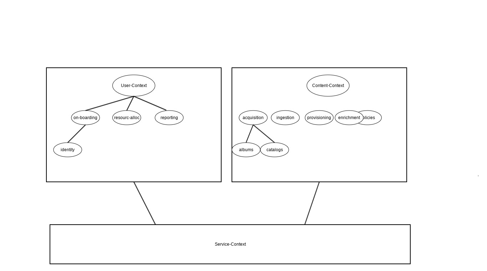

RSong Story Board
--
The purpose of this section is to provide a high level coherent definition for 
- RSong
- RSongs purpose
- the problem space RSong is addressing

## RSong stories
The purpose of this section is to divides up the system into Bounded Contexts, each of which can have a unified model - essentially a way of structuring MultipleCanonicalModels.
This section
- User-context
- Content-Context
- Service-Context

### User-Context
This section encapsulates, and defines the specific responsibilities of the user-context to the model.

User context is fragmented to:
- providers
- consumers

#### Providers
Content providers are artists or catalog owners. Stories are:
- on-boarding
- reporting
- monetization

##### on-boarding
- identity
- individual content
- catalog owners

##### reporting
TBD: Provide definition 

##### monetization
TBD: Provide definition 
Smart contract related 

#### Consumers
Content consumers are the viewers of the system.  Stories are:
- on-boarding
- reporting
- resource allocations

##### on-boarding
TBD: Provide definition 

##### reporting
report on token consumption

##### resource allocations
token allocation/consumption

### Content-Context
This section encapsulates, and defines the specific responsibilities of the context-context to the model.

Contents are RSong related assets, *Songs*., songs.  Stories are:
- acquisition
- ingestion
- provisioning
- enrichment
- policies 

#### acquisition
Content acquisition the entry of assets to the RSong system. The flow is: 

acquisition -> ingestion -> provisioning

acquisition is fragmented to: 
- album
- catalog
Once assets are acquired they
- validation
- verification
##### albums
TBD: Provide definition 

##### catalog
TBD: Provide definition 

#####  validation
TBD: Provide definition 

#####  verification
TBD: Provide definition 

#### ingestion
ingestion occurs where we have complete asset.

#### provisioning
make an asset searchable/playable

#### policies 
TBD

### Service-Context
This section encapsulates and defines functionality and feature the system provides

